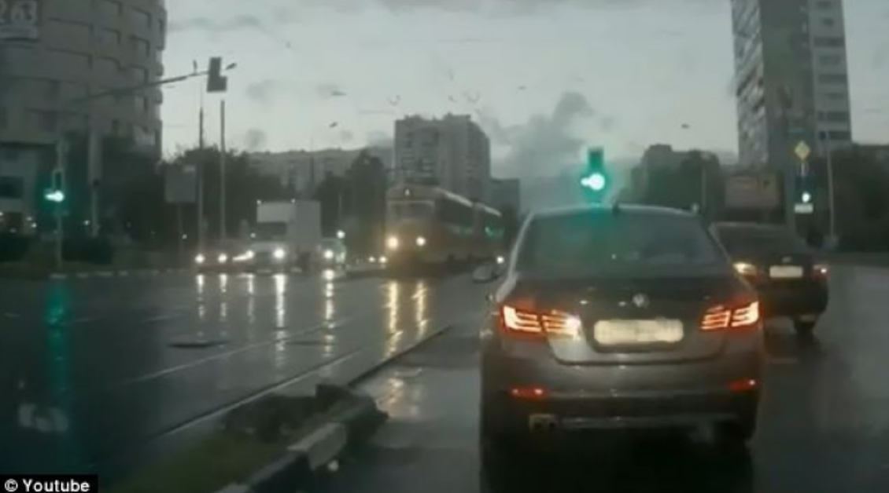

# Number Plate Detection using OpenCV

This project demonstrates how to detect and blur number plates from images using OpenCV and Haar Cascade Classifiers.

##  Files Included

- `main.ipynb`: Main Jupyter notebook with code
- `car_plate.jpg`: Input image
- `haarcascade_russian_plate_number.xml`: Pre-trained Haar cascade file

## Overview

The program performs the following steps:
1. Loads the input image using OpenCV
2. Detects the number plate using a Haar Cascade classifier
3. Draws a bounding box around the plate
4. Applies a blurring effect to the plate region
5. Displays the processed results

## Results

### Original Image


---

### Image with Bounding Box


---

### Blurred Number Plate


---

## Tools Used

- Python
- OpenCV
- Haar Cascade Classifier
- Matplotlib (for visualization)

## How to Run

1. Install required libraries:
   ```bash
   pip install opencv-python matplotlib
